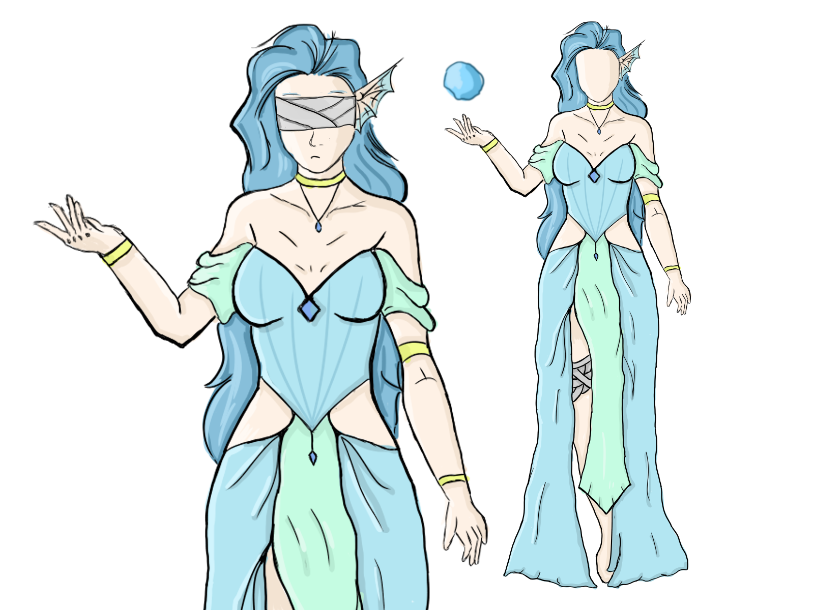
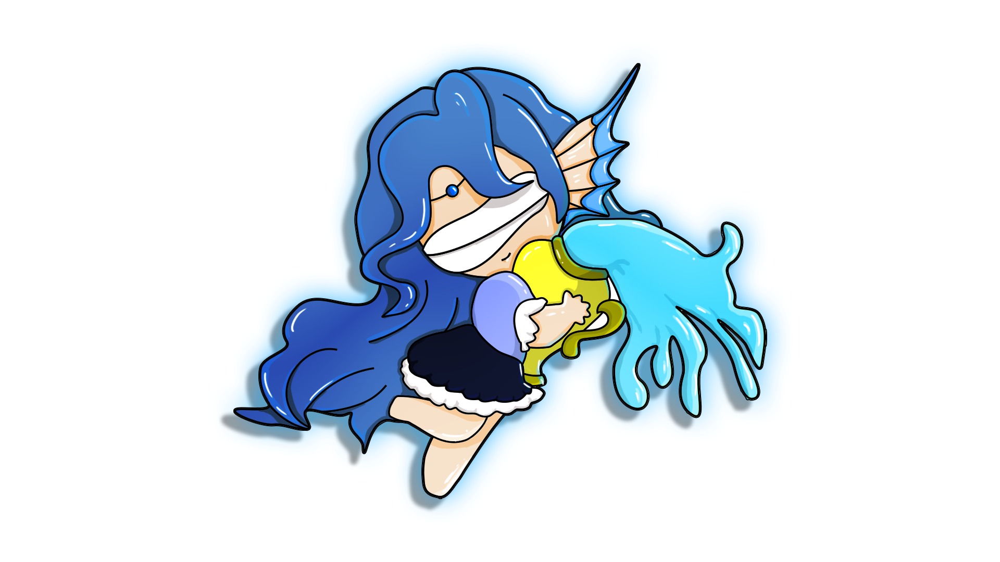

# 🎨 2D Digital Art for Video Games - Coursework

This repository serves as a portfolio for the **2D Digital Art for Video Games** course (*Arte Digital 2D para Vídeojogos*), part of the **Engineering and Game Development** degree at **IPCA**.

**Academic Year:** 2025/2026

## 📜 Project Overview
The main goal of this course was to create a comprehensive design for an **Original Character (OC)**, starting from the concept phase, moving to different art styles (Chibi), and finally integrating it into a game environment via Pixel Art.

## 🖼️ Gallery & Assignments

### 1. Character Design & Concept
**Folder:** `Character Design and concept`
Creation of the Original Character, including full-body design and concept exploration.
*(Source files: .mdp included in folder)*

### 2. Chibi Version
**Folder:** `Character Chibi Version`
Stylized "Chibi" adaptation of the original character.
*(Source files: .mdp, .svg included in folder)*

### 3. Pixel Art & Game Integration
**Folder:** `Chracter Pixel Art animation and integration in a game`
Creation of sprite sheets and animations using **Piskel**, and integrating the character into a playable game environment.

**Sprite Sheet Preview:**
.png)

#### 🎥 Gameplay Demo
> **[Click here to watch the Game Integration Video (MP4)](Chracter Pixel Art animation and integration in a game/Mp4 of the game integration.mp4)**

## 💻 Software Used
* **MediBang Paint Pro** (.mdp files)
* **Piskel** (Pixel art animations)
* **Vector Tools** (.svg)

## 👤 Artist
* **Anthony Frade**

---
*Disclaimer: All artwork in this repository was created for educational purposes.*
